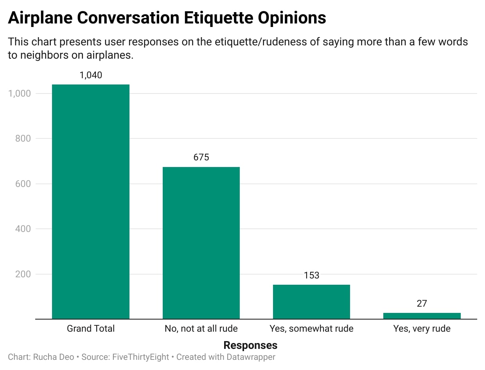

# flying-etiquette

I picked the question of airplane conversation etiquette because I found this topic to be really interesting and relatable to day-to-day situations. As someone who travels a lot and sometimes strikes up conversations with passengers next to me, I was curious to know what the general perception was of doing so during plane rides. This dataset overall was really interesting and honestly entertaining to read through. I enjoyed the specificity of some of the questions, such as "On a 6 hour flight from NYC to LA, how many times is it acceptable to get up if you're not in an aisle seat?". 

My chart is a column chart that reveals respondents' opinions on whether it is rude or not to say more than a few words to neighbors on airplanes. I expected the general consensus to be mostly nos, which is what the chart presented. 675/1,040, or almost 65% of respondents stated that it was not rude at all for people to say more than a few words to neighbors on a flight. The chart also shows that 153 said it was somewhat rude, while only 27 said it was very rude. Below is the chart discussed:

